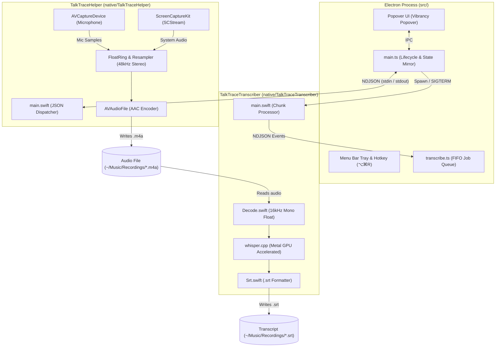

# TalkTrace

<p align="center">
  <strong>Native macOS menu bar app for seamless system audio + microphone recording with local Metal-accelerated whisper transcription.</strong>
</p>

<p align="center">
  <a href="https://github.com/mhmdiqbal/talk-trace/releases"></a>
  
  
  
  <a href="LICENSE"></a>
  
</p>

---

TalkTrace records what your Mac is playing combined with your microphone directly into a single stereo `.m4a` file.

**No virtual audio cables. No BlackHole. No Loopback.** Built natively on macOS 15+ using Apple's `ScreenCaptureKit`, TalkTrace captures pristine system audio and resampled mic audio without kernel extensions or virtual audio drivers, then transcribes speech entirely on-device using Metal-accelerated `whisper.cpp`.

---

## Table of Contents

- [User Guide](#user-guide)
  - [Key Features](#key-features)
  - [UI & Menu Bar States](#ui--menu-bar-states)
  - [Installation & Setup](#installation--setup)
  - [Permissions](#permissions)
  - [On-Device Transcripts](#on-device-transcripts)
  - [Limitations](#what-it-cannot-do)
- [Developer & Architecture Guide](#developer--architecture-guide)
  - [System Architecture](#system-architecture)
  - [Process Model & IPC](#process-model--ipc)
  - [Graceful Shutdown & Data Safety](#graceful-shutdown--data-safety)
  - [Prerequisites & Building from Source](#prerequisites--building-from-source)
  - [Code Signing](#code-signing)
  - [Testing & Quality Gates](#testing--quality-gates)
  - [Code Analysis (SonarQube)](#code-analysis-sonarqube)
  - [Environment Variables & Debugging](#environment-variables--debugging)
  - [Audio Tuning](#audio-tuning-clipping-knob)
  - [Repository File Map](#repository-file-map)
- [Privacy & Security](#privacy--security)
- [Contributing](#contributing)
- [License](#license)

---

## User Guide

### Key Features

- **System Audio + Mic Mix**: Captures whatever your Mac plays plus your selected microphone into a single stereo AAC file (`48 kHz`, `128 kbps`).
- **Efficient Storage**: Encoded to `~/Music/Recordings/YYYY-MM-DD_HH-mm-ss.m4a` (~44–70 MB per hour via variable bitrate AAC).
- **Global Hotkey**: Press `⌥⌘R` (`Option + Command + R`) anywhere to instantly start, stop, or manage recordings.
- **Real-Time Dual Level Meters**: Live peak and VU bars for both system audio and microphone to verify levels at a glance.
- **Pause & Resume**: Seamlessly pause long meetings; silent pause intervals are cleanly spliced out of the final audio.
- **Sleep Prevention**: Automatically assertions system sleep while actively recording.
- **Local-First Whisper Transcription**: Generates synchronized `.srt` subtitles on-device immediately after recording stops. Zero cloud calls, zero subscriptions, zero API keys.

---

### UI & Menu Bar States

TalkTrace lives unobtrusively in your macOS menu bar:

| Menu Bar Icon | Status | Meaning |
|:---:|:---|:---|
| `⚪` (Ring) | **Idle** | Ready to record. Click to open popover or press `⌥⌘R`. |
| `🔴` (Solid Red) | **Recording** | Active recording session. Level meters and timer running. |
| `🟡` (Amber Dot) | **Paused** | Recording is paused. Duration counter is frozen. |
| `⚙️` (Transcribing) | **Processing** | Audio saved; local whisper worker is generating `.srt`. |

The popover window utilizes native macOS vibrancy (`vibrancy: "popover"`) to blend seamlessly with your wallpaper and theme (supporting Dark Mode and Reduced Transparency).

---

### Installation & Setup

#### Pre-Built App (.dmg)

1. Download the latest `TalkTrace-x.x.x-arm64.dmg` from [Releases](https://github.com/mhmdiqbal/talk-trace/releases).
2. Open the DMG and drag **TalkTrace** into your `/Applications` folder.
3. Launch **TalkTrace** from Applications or Spotlight.

---

### Permissions

TalkTrace requires two macOS permissions to operate. macOS prompts for each permission on first launch:

```
┌─────────────────────────────────────────────────────────────┐
│  1. Screen Recording                                        │
│     Required by Apple ScreenCaptureKit to capture internal  │
│     system audio. No video is ever captured or saved.       │
├─────────────────────────────────────────────────────────────┤
│  2. Microphone                                              │
│     Required to capture your voice from your chosen input.  │
└─────────────────────────────────────────────────────────────┘
```

> [!IMPORTANT]
> **Permission Ownership**: Permissions belong to the signed helper binary (`com.mmdiqbal.talktrace.helper`), not Electron. This ensures permissions survive Electron hot-reloads and application updates.

> [!NOTE]
> **Missing Microphone Grant**: If the Microphone permission is missing or denied, TalkTrace will still record system audio and display an inline notice (`#micNote`). If Screen Recording is missing, recording is blocked until granted.

---

### On-Device Transcripts

When a recording stops, TalkTrace immediately launches a background transcription worker:

- **Output**: Saves an industry-standard subtitle file `~/Music/Recordings/YYYY-MM-DD_HH-mm-ss.srt` beside the `.m4a`.
- **Notification**: A native macOS notification alerts you when transcription finishes. Click the notification to reveal the file in Finder.
- **Performance**: Leverages Apple Silicon Metal GPU acceleration (`whisper.cpp`). Processing runs at **~50x real-time speed** (a 1-hour audio recording transcribes in ~1 minute, consuming ~850 MB RAM).
- **Model Storage**: On first launch, the `ggml-small.en` model (488 MB) is automatically downloaded to `~/Library/Application Support/TalkTrace/models/` and verified via SHA-1.
- **Interruption Resilience**: If interrupted (quitting or starting a new recording), partial work is preserved as `.partial.srt` and automatically resumed on next launch.
- **Hallucination Suppression**: Speechless segments (`[BLANK_AUDIO]`) are automatically suppressed to prevent Whisper hallucination loops.

> [!TIP]
> **Recording Always Takes Priority**: Whisper utilizes all CPU/GPU cores. Starting a new recording instantly suspends any active transcription job to ensure zero dropped audio frames.

---

### What It Cannot Do

- **Per-App Audio Isolation**: `ScreenCaptureKit` captures the entire system output mix playing through your speakers or headphones. TalkTrace displays your active output device name for transparency.
- **Multilingual Transcription (Default Model)**: The default model is English-optimized (`ggml-small.en`). Recordings in other languages will produce English-approximated phonetics.

---

## Developer & Architecture Guide

### System Architecture

TalkTrace employs a hardened 3-process architecture separating UI, audio capture, and ML inference across strict boundaries:



---

### Process Model & IPC

1. **Electron (`src/main/`, `src/renderer/`)**:
   - Manages the tray icon, vibrancy popover window, global shortcuts, power save blockers, and notifications.
   - Touches zero raw audio data.
   - Communicates with helpers via newline-delimited JSON (NDJSON) over standard streams.

2. **`TalkTraceHelper` (`native/TalkTraceHelper/`)**:
   - Standalone Swift binary holding the `ScreenCaptureKit` stream and microphone inputs.
   - Resamples incoming buffers into a unified 48 kHz stereo stream via `FloatRing` and `AVAudioConverter`.
   - Writes directly to `.m4a` using `AVAudioFile`.
   - Protocol pair: [`src/main/protocol.ts`](file:///Users/mmdiqbal/Projects/record-app/src/main/protocol.ts) ↔ [`native/TalkTraceHelper/Sources/Protocol.swift`](file:///Users/mmdiqbal/Projects/record-app/native/TalkTraceHelper/Sources/Protocol.swift).

3. **`TalkTraceTranscriber` (`native/TalkTraceTranscriber/`)**:
   - Standalone Swift binary embedding compiled `whisper.cpp` with embedded Metal kernels.
   - Spawned per job by Electron; streams progress JSON events to stdout.
   - Protocol pair: [`src/main/transcriptProtocol.ts`](file:///Users/mmdiqbal/Projects/record-app/src/main/transcriptProtocol.ts) ↔ [`native/TalkTraceTranscriber/Sources/TalkTraceTranscriber/TranscriptProtocol.swift`](file:///Users/mmdiqbal/Projects/record-app/native/TalkTraceTranscriber/Sources/TalkTraceTranscriber/TranscriptProtocol.swift).

---

### Graceful Shutdown & Data Safety

Unclean shutdowns on audio encoders can corrupt container metadata (missing Moov atom in `.m4a`). TalkTrace guarantees file integrity through three safeguards:

1. **Graceful Electron Quit**: `app.on("before-quit")` catches termination, prevents default exit, issues a `stop` command to the helper, and waits for the helper's `stopped` confirmation before exiting.
2. **Idempotent Signal Trapping**: The Swift helper intercepts `SIGINT`/`SIGTERM` and awaits active audio buffer finalization before process exit.
3. **Orphan Prevention**: If the Electron parent process dies unexpectedly, the helper detects `getppid() == 1` and stops recording immediately to prevent disk exhaustion.

---

### Prerequisites & Building from Source

#### Prerequisites

- **Hardware**: Apple Silicon Mac (M1/M2/M3/M4)
- **OS**: macOS 15.0 (Sequoia) or higher
- **Node.js**: `>= 22.0.0`
- **Package Manager**: `pnpm` 11 (`corepack enable`)
- **System Tools**: Xcode / Command Line Tools, `cmake`, `shellcheck`, `ruff`

```bash
brew install cmake shellcheck ruff
```

#### Build Instructions

```bash
# 1. Clone repository
git clone https://github.com/mhmdiqbal/talk-trace.git
cd talk-trace

# 2. Install dependencies
pnpm install

# 3. Build binaries, compile whisper, and start in development mode
pnpm start

# 4. Package production DMG and Application bundle
pnpm run dist
```

> [!NOTE]
> On the first build, `scripts/build-whisper.sh` fetches and compiles `whisper.cpp` with Metal support into `native/vendor/`. Subsequent builds are cached via a stamp file.

---

### Code Signing

`TalkTraceHelper` requires stable code signing for macOS TCC permission persistence:

- `pnpm start` automatically selects any valid `Apple Development` certificate found in your Keychain.
- If no certificate is found, it falls back to ad-hoc (`-`) signing.
- Explicit certificate selection:
  ```bash
  TALKTRACE_IDENTITY="Apple Development: Your Name (TEAMID)" pnpm start
  ```
- Distribution signing and notarization:
  ```bash
  CSC_NAME="Developer ID Application: Your Name (TEAMID)" pnpm run dist
  ```

---

### Testing & Quality Gates

#### 1. 5-Gate Linting

```bash
pnpm lint         # Runs all 5 linting checks in scripts/lint.sh
pnpm typecheck    # TypeScript checks across both tsconfigs
```

| Check | Tool | Scope |
|---|---|---|
| **TypeScript Types** | `tsc --noEmit` | `tsconfig.json` and `tsconfig.renderer.json` |
| **Code Style** | ESLint 10 (`strictTypeChecked` + `@stylistic`) | `src/`, `build/*.cjs` |
| **Swift Formatting** | `swift format lint --strict` | `native/TalkTraceHelper`, `native/TalkTraceTranscriber` |
| **Shell Scripts** | `shellcheck` | `scripts/*.sh` |
| **Python Utilities** | `ruff check` & `ruff format --check` | `scripts/*.py` |

#### 2. Regression Suite

```bash
pnpm test         # Pretest runs lint, then executes scripts/regression.sh (9 checks)
```

The regression suite tests:
- Clean start / stop recording cycles.
- Pause gap splice verification.
- Mic audio stream verification (`micFramesMixed` validation).
- Process termination mid-recording and crash recovery.
- Orphan parent-death cleanup.
- Whisper transcriber execution against synthesized speech.

#### 3. Audio Signal Diagnostics

Inspect recorded `.m4a` files for signal integrity and clipping:

```bash
python3 scripts/energy.py /path/to/recording.m4a    # Calculates RMS and Peak levels
python3 scripts/spectrum.py /path/to/recording.m4a  # Plots dominant frequencies
```

---

### Code Analysis (SonarQube)

Run SonarQube locally using Podman / Docker:

```bash
./scripts/sonarqube.sh start   # Starts SonarQube & Postgres on http://localhost:9000
pnpm sonar                     # Runs SonarQube scanner against src/ and scripts/
./scripts/sonarqube.sh stop
```

> [!NOTE]
> SonarQube Community edition inspects TypeScript and Python. Swift source code is validated via strict `swift-format` gates.

---

### Environment Variables & Debugging

| Variable | Values | Description |
|---|:---:|---|
| `TALKTRACE_DEBUG` | `1` / `0` | Un-mutes whisper/ggml logs and prints all helper events except high-frequency `level`. |
| `TALKTRACE_NO_TRANSCRIBE` | `1` / `0` | Disables whisper model download and all transcription worker spawns. |
| `TALKTRACE_SELFTEST` | `1` / `0` | Runs automated headless start/pause/resume/stop lifecycle tests. |
| `TALKTRACE_SELFTEST_SECONDS` | Number | Sets selftest duration (default: `12` seconds). |
| `TALKTRACE_IDENTITY` | String | Specifies exact Apple Developer signing certificate name. |
| `TALKTRACE_TRACE` | File Path | Directs Swift helper lifecycle logs to a file (e.g. `/tmp/trace.log`). |
| `TALKTRACE_ATTACH_SCREEN` | `1` / `0` | Attaches dummy video stream to `SCStream` for debugging. |

---

### Audio Tuning (Clipping Knob)

`Recorder.swift` mixes system audio and mic inputs by summing float sample buffers. If listening to loud music while speaking loudly into a hot microphone, digital clipping can occur.

To adjust input gain headroom, modify `systemGain` and `micGain` in [`native/TalkTraceHelper/Sources/Recorder.swift`](file:///Users/mmdiqbal/Projects/record-app/native/TalkTraceHelper/Sources/Recorder.swift):

```swift
private let systemGain: Float = 0.7  // Default: 1.0
private let micGain: Float = 0.7     // Default: 1.0
```

---

### Repository File Map

```
talk-trace/
├── native/
│   ├── TalkTraceHelper/Sources/        # Swift audio capture helper (ScreenCaptureKit)
│   │   ├── main.swift                  # Stdin NDJSON loop, signal traps, dispatch
│   │   ├── Recorder.swift              # SCStream management, mixer, AVAudioFile writer
│   │   ├── Resampler.swift             # AVAudioConverter wrapper for 48kHz alignment
│   │   ├── FloatRing.swift             # Lockless ring buffer for mic synchronization
│   │   ├── AudioMath.swift             # VU / peak calculations and clamping
│   │   ├── Devices.swift               # CoreAudio device enumerator
│   │   ├── Permissions.swift           # TCC screen & mic permission verification
│   │   └── Protocol.swift              # Swift Codable command/event definitions
│   └── TalkTraceTranscriber/Sources/   # Swift on-device whisper worker
│       ├── main.swift                  # Argv parser and chunk runner loop
│       ├── Decode.swift                # Converts .m4a to 16kHz mono PCM float
│       ├── Transcribe.swift            # whisper.cpp Metal binding callbacks
│       ├── Srt.swift                   # Formatted SRT block streaming
│       └── TranscriptProtocol.swift    # Transcriber NDJSON event protocol
├── src/
│   ├── main/                           # Electron main process
│   │   ├── main.ts                     # Tray, menu bar lifecycle, popup sizing
│   │   ├── helper.ts                   # Helper child process manager & NDJSON pipe
│   │   ├── transcribe.ts               # Background transcript queue & worker manager
│   │   ├── model.ts                    # Model download, checksum & cache manager
│   │   ├── protocol.ts                 # TS audio protocol mirror (hand-synced)
│   │   ├── transcriptProtocol.ts       # TS transcript protocol mirror (hand-synced)
│   │   ├── micMenu.ts                  # Native macOS microphone selector menu
│   │   └── messages.ts                 # UI message & time formatting helpers
│   ├── preload/                        # Electron secure context bridge
│   └── renderer/                       # Vibrancy popover UI (HTML / Vanilla CSS / TS)
├── scripts/                            # Build, test, lint, and analysis scripts
└── build/                              # Entitlements, plists, and packaging hooks
```

---

## Privacy & Security

TalkTrace is engineered around a strict local-first privacy policy:

- **100% Offline Processing**: System audio and microphone inputs are mixed in-memory and written directly to your local drive.
- **Zero Cloud Services**: Whisper transcription executes on your local GPU via Apple Silicon Metal. No audio or transcriptions ever leave your machine.
- **No Telemetry**: TalkTrace contains zero analytics, tracking, or network telemetry.

For vulnerability disclosure and security policy, see [SECURITY.md](file:///Users/mmdiqbal/Projects/record-app/SECURITY.md).

---

## Contributing

Contributions, bug reports, and suggestions are welcome!

- Please review [CONTRIBUTING.md](file:///Users/mmdiqbal/Projects/record-app/CONTRIBUTING.md) for local environment setup, architecture guardrails, and PR guidelines.
- Please adhere to our [CODE_OF_CONDUCT.md](file:///Users/mmdiqbal/Projects/record-app/CODE_OF_CONDUCT.md).

---

## License

This project is open-source software licensed under the [MIT License](file:///Users/mmdiqbal/Projects/record-app/LICENSE).
